# Tutorial Docker y AWS

## Introducción

## Objetivos

## Docker
* Docker es una plataforma para desarrollar, desplegar y correr aplicaciones con contenedores. 

* Permite crear una aplicación y empaquetarla junto con sus dependencias y librerías en un contenedor que será capaz de ejecutarse en cualquier otra máquina que disponga de una capa para la gestión de dichos contenedores.

* La contenedorización es popular ya que es:
  - Flexible: incluso las aplicaciones mas complejas pueden ser contenidas en contenedores.
  - Ligera: los contenedores aprovechan y comparten el núcleo de host.
  - Intercambiable: puede implementar actualizaciones y actualizaciones sobre la marcha.
  - Portátil: se puede compilar localmente, implementarlo en la nube y ejecutar en cualquier lugar.
  - Escalable: puede aumentar y distribuir automáticamente réplicas de contenedor.
  - Apilable: puede apilar servicios verticalmente y sobre la marcha.

* Un contenedor se lanza corriendo una **imagen** (paquete ejecutable que incluye todo lo necesario para ejecutar una aplicación).

* Un **contenedor** es una instancia de tiempo de ejecución de una imagen.

* **Docker Deamon** es un servicio que corre en el sistema operativo host.

* **Dockerfile** es un documento que se utiliza para crear las imágenes de contenedor. Contiene toda la información de configuración y los comandos necesarios para ensamblar una imagen de contenedor. El encargado de convertir un dockerfile en un contenedor es, el Docker Daemon.

### Como se comunica el cliente con Docker.

* El cliente es donde se ejecutan diferentes comandos de Docker. Puede instalarse en Windows, Linux, MacOS. Configurado para conectarse al Docker host remoto.
* El Docker host es el servidor que ejecuta el demonio Docker (se ejecuta en una máquina virtual que usa Linux).
* El Registry es un lugar para encontrar y descargar imágenes de Docker. 

### Instalación

#### 1. Instalar Docker
##### Ubuntu
```
$ curl -fsSL https://download.docker.com/linux/ubuntu/gpg | sudo apt-
key add -
$ sudo add-apt-repository "deb [arch=amd64] 
https://download.docker.com/linux/ubuntu$(lsb_release -cs) stable"
$ sudo apt-get update
$ sudo apt-get install docker-ce
```

##### CentOS
```
$ sudo yum-config-manager --add-repo https://download.docker.com/linux/centos/docker-ce.repo
$ sudo yum install docker-ce
$ sudo systemctl start docker
$ sudo systemctl enable docker
$ sudo usermod -aG docker user1
$ sudo curl -L https://github.com/docker/compose/releases/download/1.24.0-rc1/docker-compose-`uname -s`-`uname -m` -o /usr/local/bin/docker-compose
$ sudo chmod +x /usr/local/bin/docker-compose
```

##### Windows 
Tener en cuenta que Docker solo está disponible para Windows 10 64bit: Pro, Enterprise or Education.
[Docker Desktop para Windows](https://docs.docker.com/docker-for-windows/install/)

##### MacOS
[Docker Desktop para Mac](https://docs.docker.com/docker-for-mac/install/)

#### 2. Verificar la versión de Docker
```
$ docker –version 
```
#### 3. Conocer más a fondo información sobre Docker.
Contenedores pausados, contenedores corriendo actualmente, etc.
```
$ docker info
```
#### 4. Probar que docker fue instalado correctamente.
```
$ docker run hello-world
```
Este comando debería arrojar el siguiente resultado.
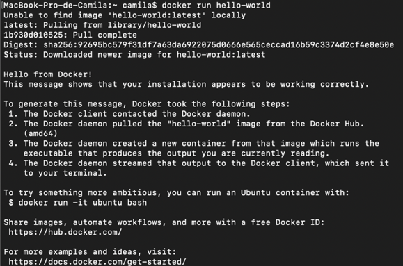

#### 5. Listar las imágenes descargadas en el computador.
```
$ docker image ls
```

#### 6. Listar los contenedores existentes corriendo actualmente.
```
$ docker container ls
```
Listar todos los contenedores existentes, incluso los que no están corriendo. 
```
$ docker container ls –all
```

#### Cheat Sheet
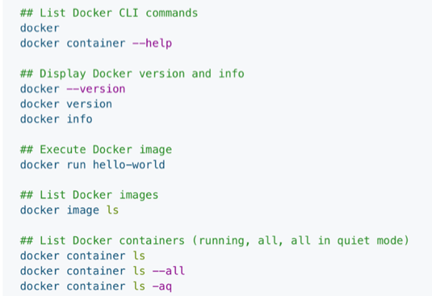

### Contenedores
* En el pasado, si comenzaba a escribir una aplicación de Python, su primera tarea era instalar un tiempo de ejecución de Python en su máquina. Con Docker, solo puede tomar un tiempo de ejecución Python portátil como una imagen, sin necesidad de instalación. Estas imágenes portátiles están definidas por algo llamado Dockerfile.

* Un **Dockerfile** define lo que sucede en el ambiente dentro de su contenedor. 

#### 1. Crear una aplicación en python (app.py) con el siguiente contenido. 
```python
from flask import Flask
from redis import Redis, RedisError
import os
import socket

# Connect to Redis                                                                                                    
redis = Redis(host="redis", db=0, socket_connect_timeout=2, socket_timeout=2)
app = Flask(__name__)
@app.route("/")
def hello():
    try:
        visits = redis.incr("counter")
    except RedisError:
        visits = "<i>cannot connect to Redis, counter disabled</i>"

    html = "<h3>Hello {name}!</h3>" \
           "<b>Hostname:</b> {hostname}<br/>" \
               "<b>Visits:</b> {visits}"
    return html.format(name=os.getenv("NAME", "world"),  hostname=socket.gethostname(), visits=visits)

if __name__ == "__main__":
    app.run(host='0.0.0.0', port=3000)
```
#### 2.	Crear el archivo requirements.txt con el siguiente contenido.
```
Flask
Redis
```
#### 3.	Instalar Flask y Redis.
```
$ pip install -r requirements.txt
```
#### 4.	Correr la aplicación.
```
$ python app.py
```
Ir al browser y buscar http://0.0.0.0:3000/ .
Deberían ver algo similar a la siguiente imagen.
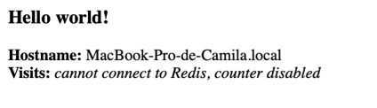

#### 5.	En este punto se tiene una aplicación funcional sin Docker.

#### 6.	Crear el Dockerfile con el siguiente contenido, este archivo sirve para crear una imagen de la aplicación. 
```Dockerfile
# Build an image starting with the Python 2.7
FROM python:2.7-slim

# Set the working directory to /app
WORKDIR /app

# Copy the current directory contents into the container at /app
COPY . /app

# Install any needed packages specified in requirements.txt
RUN pip install --trusted-host pypi.python.org -r requirements.txt

# Make port 3000 available to the world outside this container
EXPOSE 3000

# Define environment variable
ENV NAME World

# Run app.py when the container launches
CMD python app.py
```
Docker cuenta con diferentes instrucciones para componer el Dockerfile: ADD, COPY, ENV, EXPOSE, FROM, LABEL, STOPSIGNAL, USER, VOLUME y WORKDIR.

#### 7.	Correr el comando build para crear la imagen.
```
$ docker build -t nameApp .
```
#### 8.	Verificar si la imagen fue creada.
```
$ docker image ls
```
Este comando debería mostrar el siguiente resultado.
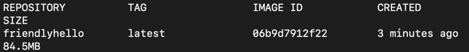

#### 9.	Correr la app.
```
$ docker run -p 3000:3000 nameApp
```
Se puede acceder a la app por medio de http://localhost:3000,  debido a que el mensaje que imprime la app viene dentro del contenedor y este no mapea el puerto 3000 con el 3000. 
También se puede correr: 
```
$ curl http://localhost:3000
```
y se obtiene lo siguiente. 
Para correr la app en detached mode, usar el siguiente comando.

```
$ docker run -d -p 3000:3000 nameApp
```
#### 10.	Si se desea parar el contenedor.
```
$ docker container stop <id>
```
#### 11. Para compartir la imagen, crear una cuenta en https://hub.docker.com si aun no la ha creado.

#### 12.	Acceder a esta desde la terminal.
```
$ docker login
```
#### 13.	Ponerle un tag a la imagen.
```
$ docker tag <image> <username/repository:tag>
```
Un ejemplo de este comando es: 
```
$ docker tag friendlyhello cwhiter/get-started:part2
```
#### 14.	Verificar que la imagen creada con el tag anterior si exista.
```
$ docker image ls
```
#### 15.	Publicar la imagen.
```
$ docker push <username/repository:tag>
```
#### 16.	Correr la imagen desde cualquier lugar. 
```
$ docker run -p 3000:3000 <username/repository:tag>
```
Y desde cualquier browser accede a http://localhost:3000.
#### Cheat Sheet
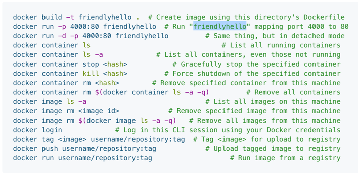

### Servicios
* Son contenedores en producción. 

* Corre solamente una imagen.

* Para esto, creamos un docker-compose, el cual define como los contenedores deberían comportarse en producción. 

* A un contenedor solo corriendo en un servicio se le llama task. 

#### 1.	Crear el docker-compose.yml con el siguiente contenido.	
```
version: "3"
services:
  web:
    # replace username/repo:tag with your name and image details
    image: username/repo:tag
    restart: always
    build: .
    ports:
      - "3000:3000"
```
Este archivo le dice a Docker que:
  * Obtenga la imagen creada previamente.
  * Reiniciar los contenedores siempre.
  *	Mapear el puerto 3000 al 3000. 

#### 2. Correr la aplicación.
```
$ docker-compose build
$ docker-compose up
```
Para correr en detached mode
```
$ docker-compose up -d
```
#### 3.	Abrir la app en un browser.

## Desplegar en AWS

#### 1. Crear una cuenta en [AWS Educate](https://aws.amazon.com/education/awseducate/).

#### 2.	Crear una maquina virtual EC2 y lanzarla. 

#### 3.	Escoger el sistema operativo Amazon Linux 2 64-bit(x86), el cual funciona como un CentOS. 


#### 4. Escoger el Free tier y presionar *Review and Launch*.
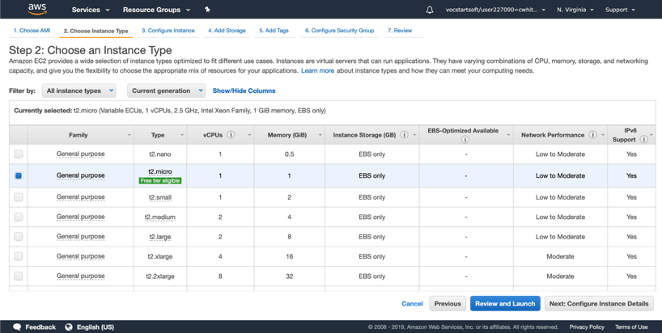
Volver a presionar *Launch*. 

#### 5. Crear una nueva *key*, darle un nombre y descargarla. 

Presionar *Launch Instance* una vez se haya descargado la *key*.

#### 6. Presionar la instancia para verificar en que estado se encuenta. 
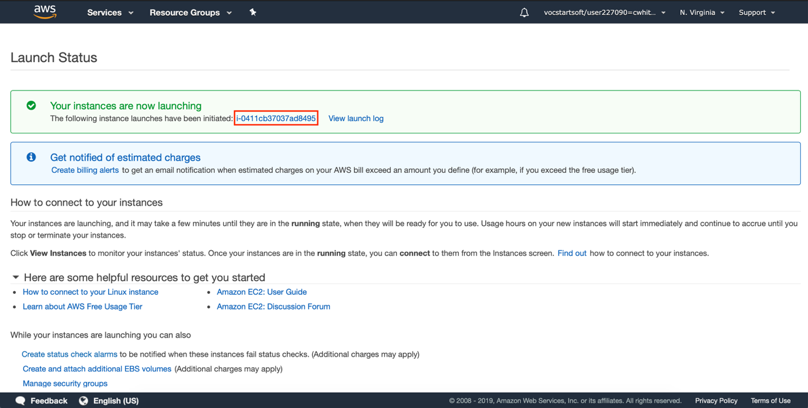
Al ser una nueva máquina virtual, su estado es *pending* (amarillo) pero luego de unos segundos cambiará a *running* (verde). 

#### 7. Darle un nombre a la máquina virtual.

#### 8. Para verificar que puertos se tiene activos, se debe seleccionar la VM e ir a la opción de seguridad. 
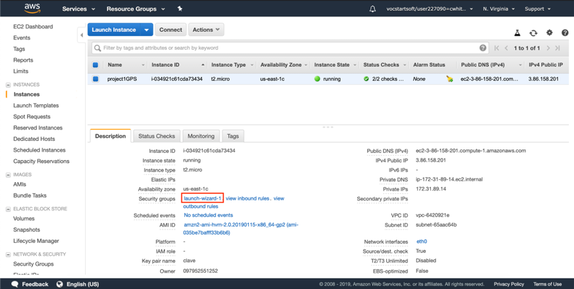
Ir a *Inbound*, en esta opción se pueden evidenciar los puertos activos en el momento. Al ser VM nueva, solo tiene el puerto 22 activado el cual está destinado a la conexión SSH.

#### 9. Añadir los puertos 80 (HTTP) y 443 (HTTPS).
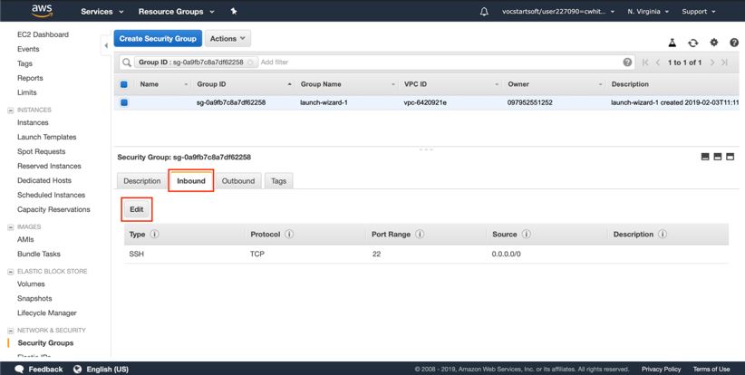
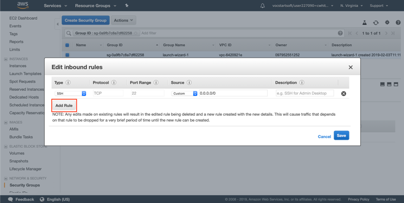
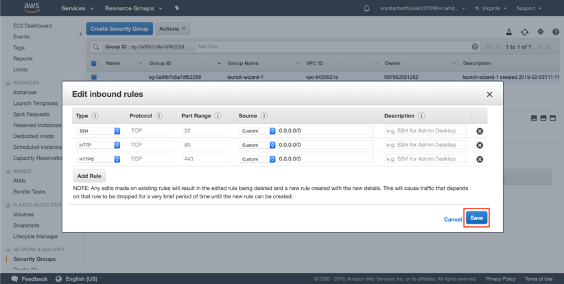

#### 10. Volver a la página principal donde se muestran todas las instancias existentes.

#### 11. Seleccionar la instancia con la que se está trabajando actualmente, e ir a “Network & Security -> Elastic IPs”.
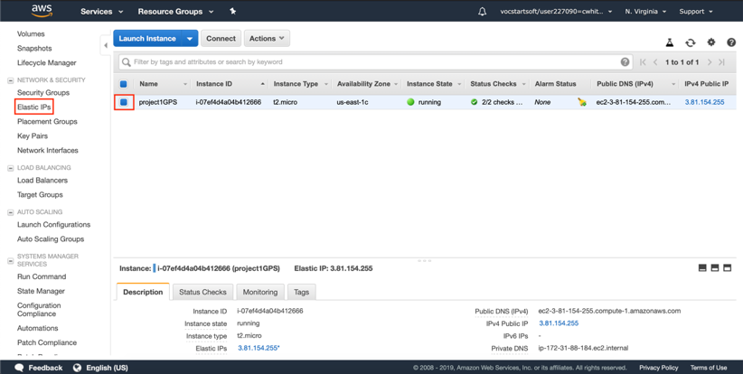

#### 12. Seleccionar Allocate New Address -> Amazon pool -> allocate.
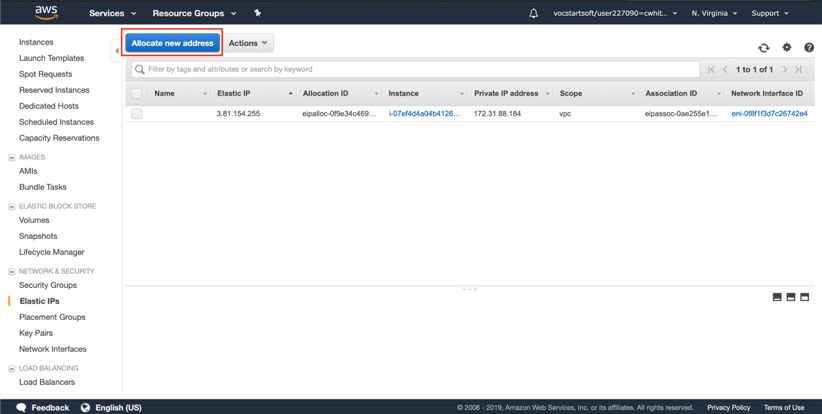
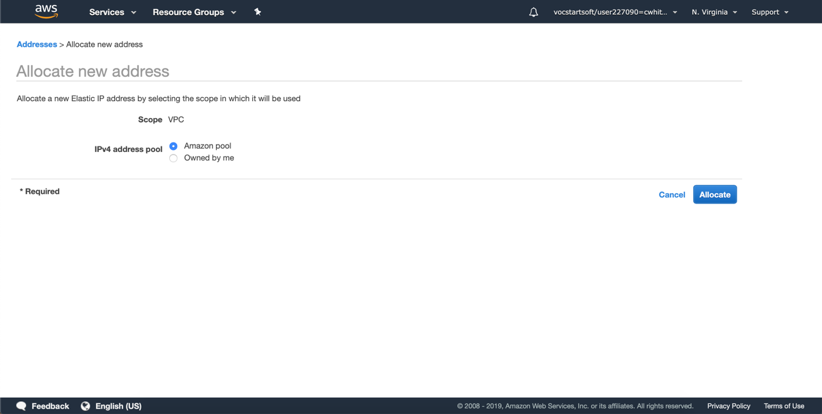

#### 13. El paso anterior generará una dirección IP. Presionar *close* y esto abrirá una interfaz con las direcciones IP creadas.

#### 14. Seleccionar la dirección IP asignada previamente, ir a Actions -> Associate Address.


#### 15. Asociar la dirección IP con la instancia creada al inicio del tutorial.
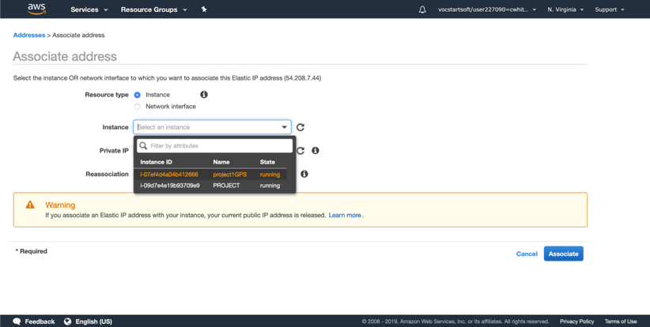

#### 16. La VM quedó configurada, ahora se procederá a la conexión.

#### 17. Verificar si existe una carpeta *.ssh* en *home* y si no existe, crearla. 
```
$ mkdir .ssh
$ cd .ssh
```
#### 18. Mover la key descargada en el numeral 5 a la carpeta *.shh*.

#### 19. Darle permisos a la key.
```
$ chmod 400 key.pem
```
#### 20. Seleccionar la instancia, ir a Actions -> Connect. Y copiar el comando de conexión de SSH. 

#### 21. Conectarse vía SSH con la VM (pegar el comando copiado en 20).
```
$ ssh -i "key.pem" ec2-user@ec2-52-22-190-33.compute-1.amazonaws.com
```
#### 22. Instalar Docker. 
```
$ sudo yum update -y
$ sudo amazon-linux-extras install docker
$ sudo service docker start
$ systemctl status docker.service
```
Este comando anterior debería arrojar el siguiente resultado.
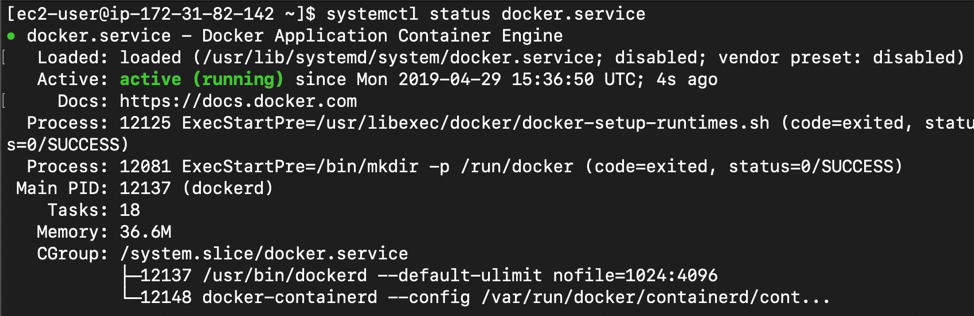
Por ultimo, realizar los siguientes comandos.
```
$ sudo usermod -a -G docker ec2-user
$ exit
```
#### 23. Volver a conectarse a la VM y verificar la versión de docker.
```
$ docker --version
```
#### 24. Instalar docker-compose.
```
$ sudo curl -L https://github.com/docker/compose/releases/download/1.22.0/docker-compose-$(uname -s)-$(uname -m) -o /usr/local/bin/docker-compose
$ sudo chmod +x /usr/local/bin/docker-compose
$ docker-compose version
```
El ultimo comando debería arrojar algo similar a la siguiente imagen.
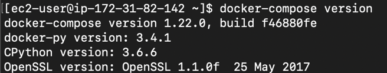

#### 25. Desplegar la app con docker.
Clonar el repositorio o escribir nuevamente app.py, requirements.txt, Dockerfile y docker-compose.yml.
Para un funcionamiento correcto en AWS, crear un archivo **nginx.conf** con el siguiente contenido, este paso se realiza solo si no se clonó el repositorio. 
```
events {
	  worker_connections  1024;  ## Default: 1024
}
http {
	    server {
	        listen 80;
	        server_name localhost;
	        
	        location / {
	            proxy_pass http://web:3000;
	            proxy_http_version 1.1;
	            proxy_set_header Upgrade $http_upgrade;
	            proxy_set_header Connection 'upgrade';
	            proxy_set_header Host $host;
	            proxy_cache_bypass $http_upgrade;
	    }
 }
 server {
    listen 443;
	  #server_name localhost;
	  server_name ec2-18-205-156-28.compute-1.amazonaws.com;
	  location / {
	      proxy_pass http://web:3000;
	      proxy_set_header Connection "";
	      proxy_set_header Host $host;
	      proxy_set_header X-Real-IP $remote_addr;
	      proxy_set_header X-Forwarded-For $remote_addr;
	   }
  }
}
```
Y añadir al docker-compose.yml las siguientes líneas, justo debajo de services:
```
nginx:
	    container_name: nginx-server
	    image: nginx
	    volumes:
	      - ./nginx.conf:/etc/nginx/nginx.conf:ro
	    ports:
	      - "80:80"
	      - "443:443"
	    depends_on:
	      - web
```
En este caso, NGINX funciona como proxy inverso. 
Para desplegar la aplicación, correr los siguientes comandos: 
```
$ docker-compose build
$ docker-compose up
```

#### 26. Acceder a la app por medio del dominio brindado por Amazon. 
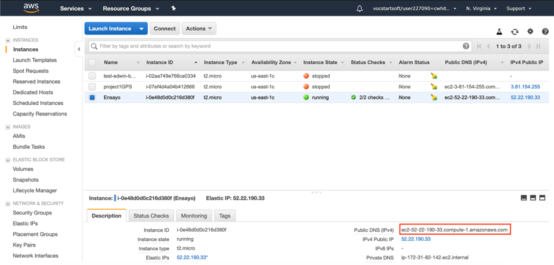

#### 27. Una vez verificado el funcionamiento con el dominio brindado, se procede a obtener un dominio propio.
Ir a [freenom](freenom.com) para obtener un dominio gratis. 
Escribir el nombre del dominio y buscar si está disponible.
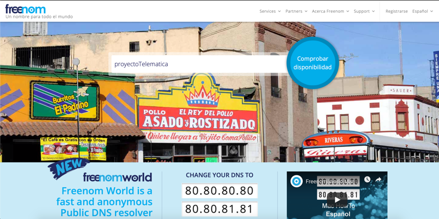

#### 28. Si está disponible, aparece una imagen similar. 
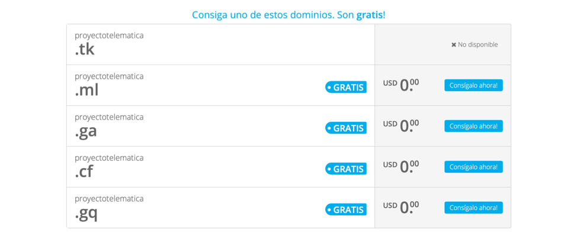

#### 29. Escoger el dominio de su gusto y asignarle la dirección IP estática de la VM de amazon. 
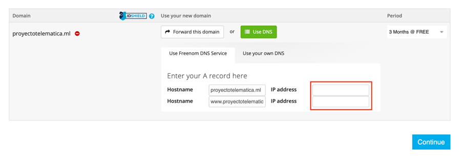

#### 30. En este punto, ya podrá acceder a su aplicación por medio del dominio.


###### Referencias
https://docs.docker.com/get-started/ 
